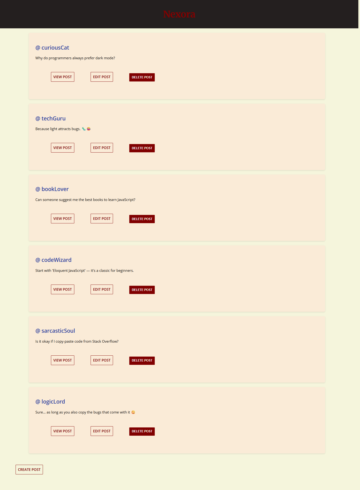

# Nexora – Social Posts Web Application


## Description
Nexora is a simple and interactive social posts web application where users can create, view, edit, and delete posts. It is built with Node.js, Express, and EJS, providing a dynamic and user-friendly interface. This project helped me understand CRUD operations, routing, and template rendering in web development.

---

## Tools & Technologies Used
- **Node.js** – JavaScript runtime environment
- **Express.js** – Web application framework
- **EJS** – Embedded JavaScript templating engine
- **UUID** – For generating unique post IDs
- **HTML, CSS, JavaScript** – Frontend development
- **Render** – For deploying the web application
- **Git & GitHub** – Version control and repository hosting

---

## Screenshots

### Posts Page


---

## Live Website
Check out the live deployed application here:  
🌐 [Nexora Live](https://nexora-971t.onrender.com/posts)

---

## Clone on Local Machine
You can clone this repository and run it locally:

```bash
git clone https://github.com/AnushaReddi02/Nexora.git
cd Nexora
npm install
node index.js
```
## What I Learned

- Setting up a Node.js server with Express.js

- Handling CRUD operations (Create, Read, Update, Delete)

- Using EJS for dynamic HTML rendering

- Implementing method-override to support PATCH and DELETE in forms

- Managing unique identifiers with UUID

- Deploying a Node.js application on Render

- Structuring a full-stack web project efficiently

---

## Conclusion

This project enhanced my understanding of backend and frontend integration, routing, and deploying applications online. Nexora demonstrates how to build a simple social post system from scratch using Node.js, Express, and EJS, while also giving hands-on experience with deployment and version control.
